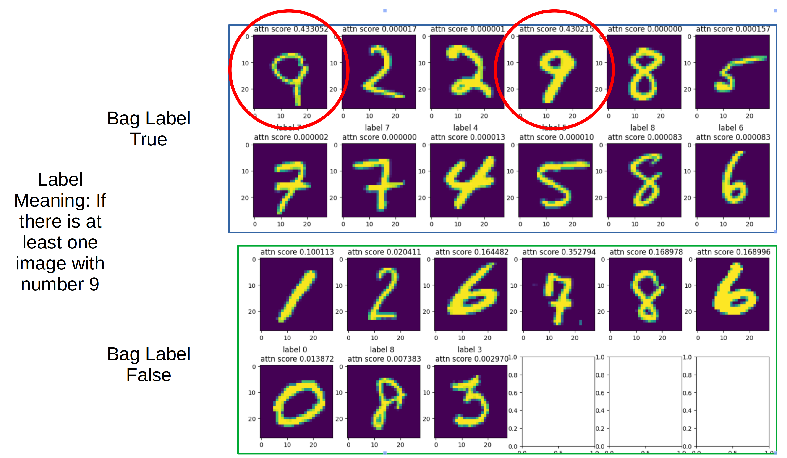

# transformer-deep-multi-instance-learning

## Motivation
Many real world use cases fall into the category of multi-instance learnings, such as medical image analysis, insurance claim photo analysis. In those use cases, the user may have multiple images taken/uploaded as input, and one final single decision as output. For examples, a customer who filed a accident claims usually upload many images, including the shot of the car, insurance policy, ids and other documents, to the insurance server as evidence, and the insurance decision are made based on one or more of those images. The instances can be in different modalities, such as videos, audios, images, and even strctured data. 

The transfomer-based foudational models make it easy to have comprehensive representation of the instances, such [DINO v2](https://arxiv.org/abs/2304.07193) for image embedding, [Bert/Roberta](https://arxiv.org/abs/1907.11692) for text embedding. Inspired by the work [Attention-based deep multiple instance learning](https://arxiv.org/pdf/1802.04712), we explore transformer architecture as a way to map the multiple instances into one embedding (CLS token embedding) and provide an easy to use code for experiments. 

With precomputed embedding as input, those mult-instance architectures can be builtlighte-weighted with only 1 or 2 blocks and deployed for real-time inference. 


## Input data

The image/text data should be encoded by a foundation model before feeding into the MIL model. We use MNST data for our development test and the open source DINO v2 model as our image encoder. A [notebook](notebooks/Minst_data.ipynb) is used to download the MNST data, and the hugging face transformers package was used to encode and save the embedding. MNST data is the handwrite images for numbers from 0 to 9 and the corresponding labels. The multi-instance learning data are organized in bags, in each bag there are a variable number of instances, and only one label for each bag. To simulate this kind of data, we randomly (uniform) drop a random number of images (poisson) from MNST training set, put them in a bag. If there are m numbers of images with labels equal to the target number, then the bag is labeled as one, and vice versa. For example, if we set m to be 1 and target number to be 9, when there is at least one image with label 9 in the randomly generated bag, then the bag is labeled as 1. For this tak, we provided a MnstBagsGenerator (in tdmil/dataloader.py). 


For the real data, you can put the image embeddings on the disk, and provide a csv file to our data loader in the following format. The first column is the path to the file for the embeddings for each bag, the second column is the length of the bag, and the third column is the label. The NumpyGenerator (in tdmil/dataloader.py) is provided to handle this format. Check the train script (tdmil/train.py) for the useage of these dataloaders. 
```
array_path,bag_length,target
datasets/MNST_train/0/0/bagLength_027_target_1_train_0362635.npy,27,1
datasets/MNST_train/0/0/bagLength_038_target_0_train_0790037.npy,38,0
datasets/MNST_train/0/0/bagLength_022_target_0_train_0935236.npy,22,0
datasets/MNST_train/0/0/bagLength_019_target_0_train_0061694.npy,19,0
```

Note that the training is I/O bound it is best to hold the data on the fastest media and handle the bagging logic on the fly. If your GPU has enough memory, it is best to hold the embeddings on the GPU and handle the bag logic there. The second option is to hold the embeddings on cpu Mem and the slowest option is to read embedding directly from disk for each epoch. If you hard drive is not SSD, it is recommended to use hdf format. 

## Model architecture

For the multi-instance learning, we tested two attention machanism. The first is the very light-weighted attention (MILAttention in tdmil/modelMIL.py) adapted from the [attention-based deep multi-instance learning] (https://github.com/AMLab-Amsterdam/AttentionDeepMIL/blob/master/model.py), and the second one is the transformer based architecture (TransformerMIL in tdmil/modelMIL.py) adapted from ViT. 

## train with config file 
We provide a configurable training script for experiment tracking. The example configuration files can be found in the fold cofig/. The log file, the checkpoint and the configuration file will be saved in model_weights/ with the corresponding test name. 

```
## enter the work environment 
make env 

## train model with configuration file 
python3 tdmil/train.py --config_file config/mnst_transformer_complexTarget.json
```

## Experiment Insight with MNST data

For the simple task, such as given a variable number of images, determine if there is at least one image with number 9. The simple MILAttention attention can achived a decent f1 score of 0.97, and the interpretation of the attention score is very intuitive. As in the following figure, when the model predict the label is true, the attention score on the images with number 9 is more than other images. 



However, for more complex task, such as prediction if there are at least 4 images with number 9 in the bag, the performance of MILAttention drops from f1 of 0.97 to f1 of 0.70. But for the transformer-based attention, the f1 score can be boosted to 0.90. That is more or less expected as the transformer model is more complex with more parameters and can fit into the more complex task. But the intuitive interpretation of the attention weight is lost in the complexity. 


## Environment 
A docker file is provided to manage the enviroment for this repo. You need to have GPU on your PC, and cuda 11.7+ and the GPU driver installed. 
```
## Enter docker env
make env

## Open a jupyter notebook 
make jupyter 
```